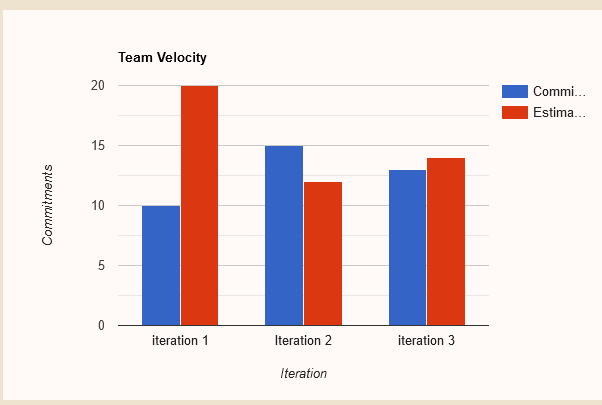

---

title : Welcome to ListMyCourses
---

## Our Vision Statement

**A brilliant application that brings U of M students the ability to easily
manage and plan their courses.** ListMyCourses brings two things together: a
course scheduler and a course tracker. This integrated solution provides
students a useful tool for planning their courses and tracking their progress in
their programs, helping them succeed in achieving their educational goals.
<iframe width="560" height="315" src="https://www.youtube.com/embed/hM5q-QEoY5c" title="YouTube video player" frameborder="0" allow="accelerometer; autoplay; clipboard-write; encrypted-media; gyroscope; picture-in-picture" allowfullscreen></iframe>

## <ins> Intended User </ins>

ListMyCourses is mainly designed for U of M undergraduate students who seek
better organization for planning their courses. Our app aims to provide a
one-stop shop that allows students to plan their program with easy access to
information they may need such as pre-requisites, GPA, credit hours, weekly
schedules, and information about courses. This should prove to be useful for
many students as the current existing systems in place make it difficult to have
such an experience.

Professors will also be able to use ListMyCourses. This project shall allow
professors to define the requirements and grading schemes of the courses they
teach, giving students access to course information typically given in a
syllabus. For students taking their course, the professor will be able to
distribute grades on assignments and tests, allowing students to monitor their
performance.

## <ins> PostMortem </ins>

### What was the overall architecture of your system (particularly if it is different from the demo system)?

ListMyCourses is a project that has the following architecture which follows the 3-tier Presentation-Logic-Data
general architecture. The Presentation layer has a dedicated package and also the logic layer and the data layer.

### What went right in the development process?

Our Tean got synched with each other by the final iteration, We all did our work and from the very start of iteration 2 started working on our tech debt which made our lives more easier and you know how the story ends, They all lived happily everafter.

## <ins> Velocity Graph </ins>

This velocity graph shows that we over estimated in the first iteration and in the next 2 iterations had to understimate becuase we were delaing with lot of tech debt that came from the first iteration. We decided at the very start of iteration 2 that we would estimate lower and tackle with our tech debt, that is why in iteration 2 our velocity looks like that, In iteration 3 we had to decide to move many features from our current iteration to the futrure iteration due to the lack of time so that is why our graph in iteration 3 looks like that as shown in the picture.

## <ins> Contributors </ins>

### Uy, Jin Michael

Skills : **'unit testing, writing system tests, android development**

### Yang, Fengqi

Skills : **'Presistance layer expert, writing integration tests, android development**

### Li, Jintao

Skills : **' Writing integration tests, android development, Unit Tests**

### Saeed, Nabeel

Skills : **'Andriod Development, Jeykyll enthusiastic, Presistance layer developer**

